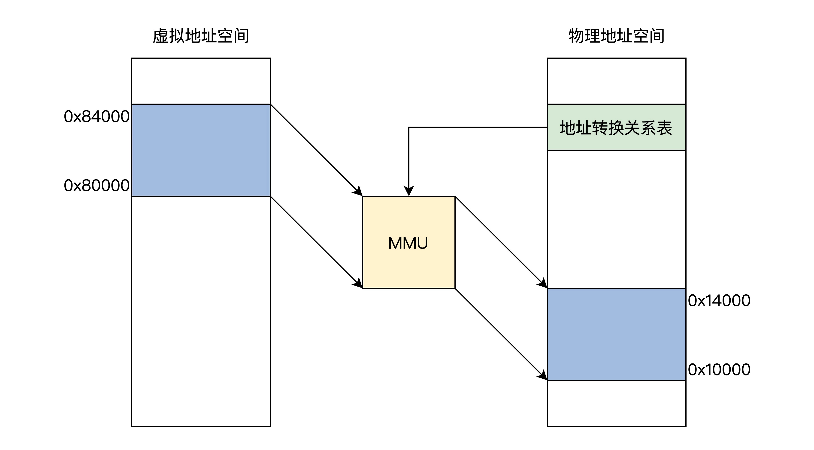

<!--
 * @Author: lizhiyuan
 * @Date: 2020-11-21 20:53:10
 * @LastEditors: Please set LastEditors
 * @LastEditTime: 2021-03-14 17:50:06
-->

# 操作系统

## 概念 -- 冯诺依曼存储思想

将程序和数据存放到计算机的内部存储器中,计算机在程序控制下一步一步的进行处理

计算机由五大部件组成:输入设备、输出设备、存储器、运算器、控制器

通俗的解释就是:计算机的工作原理是将程序放到内存中,然后用一个指针指向它(cs:ip),然后取指执行,取指执行.....

形象来看的话:当计算机打开一个 APP 应用的时候,实际是开启了一个进程,该进程会被操作系统自动执行...

总结: 取指 + 执行

## 概念 -- 数据的存储

```
int a = 10;

```

对于无符号数的存储,我们只需要考虑将代码中的 10 转化成二进制即可

```
int a = -1

```

10000 - 0001 = 1111

对于一个有符号数的存储,我们只需要考虑将他正数的使用他的模 - 本身 （二进制取反+1）

其实对于我们来讲, -1 和 + 255的效果是一样的，对吧

```
short int a = -12345 // 有符号转无符号数
unsigned short b = (unsigned short)a;

```

对于有符号数转化为无符号数的话,分为两种情况

- 当有符号的数值 < 0 的时候,存储的二进制位不变,显示变化(代表着最高位为 1),相当于十进制加上 2n 次方

- 当有符号的数值 >= 0 的时候,存储的二进制位不变,显示不变(代表着最高位为 0)

例子： 1000有符号表示-8,假设新增最高位一个,相当于前进8位后再前进8位，相当于 -8 +16 = 8 

在看一个例子:

```
int a = -1;
unsigned int b = 0;
if(a < b) // 假设是无符号数和有符号数做判断,强制将有符号数转化为无符号数来进行对比
```

结果 1111 < 0000

```
unsigned int a = 10
int b = (int)a
```

对于无符号数转化为有符号数,也分两种情况

- 当无符号的最高位为 0 的时候,二进制位不变,显示不变
- 当无符号的最高位未 1 的时候,二进制位不变,显示变化(等同于该十进制数值 - 2n 次方,最高位被占用了)

例子： 1000无符号的十进制数是8，假设转化为有符号，将最高位搞成符号位就相当于8 - 16 = -8，为啥要减去18，可以理解为如果去除一位作为符号位，相当于后退8再后退8，拢共要减去16

无符号数从较小数据类型 --> 较大数据类型,前面补 0 即可
有符号数从较小数据类型 --> 较大数据类型,前面补 1 即可 （补出来的数其实就是-1）

总结: 永远记住,一个负数在编译阶段,就已经以补码的形式存储了,只需要正常的进行加减法即可..

减法可以理解为是跟他的逆元相加（求得相加数的逆元） x + x' = 0 

无符号的逆元 = 256 - 无符号(相加正溢出的时候等于0)

有符号的逆元 = =~有符号+1 （按位取反+1）

例如： 1 - （-1） = 0001 + (1111取反0000+1 = 0001) 最终得到0010 = 2

乘法可以理解为，不管是无符号还是有符号数，都是将两个数相乘截断，有符号还要将数值转化为补码

有符号乘法 = xy=(x的补码y的补码)的补码 

***不管是什么数，统一按照二进制位进行运算，运算完后该溢出溢出，该截断截断，将截断后的结果按照不同的函数映射方式转换成无符号数或有符号数。***


## 操作系统启动简略

系统上电后，无论是从硬盘启动，还是光驱启动，或者是其他的启动方式,


## 中断/异常

中断是异步操作....CPU 和硬件设备是可以并行操作的,CPU 不必等待硬件 IO 设备的操作结果,当设备完成的时候,由设备发出中断信号告知 CPU,CPU 立即保存当前的执行情况后处理。。。

这就是操作系统首次实现异步的一个机制: 中断机制

- IO 中断
- 时钟中断 进程轮片/定时
- 硬件故障

异常其实也是种中断,只不过通常异常是 CPU 主动触发的一种中断

- 系统调用
- 页故障/页错误
- 保护性异常 (读写冲突)
- 断点调试
- 其他程序异常

总结: 中断是一些外部事件,被动触发的,异常是由正在执行的指令引起的，属于主动触发的....

***工作原理***

CPU 会在每条指令执行周期的最后时刻扫描中断寄存器,查看是否有中断信号,若有中断,通过查找中断向量表引出中断处理函数

- 128 0x80 系统调用异常中断
- 32 - 127 外部中断,IO 设备中断

举例：IO 设备硬中断

- 打印机给 CPU 发送中断信号
- CPU 处理完当前指令后检测到中断,判断出中断来源并向相关设备发确认信号
- CPU 进行`系统调用`,切换到内核态，并将现场保存(程序计数器 PC 以及程序状态字 PSW)
- CPU 根据中断向量表,获得该中断相关处理程序(内核)程序的入口地址,将 PC 设置为该地址,CPU 去执行内核中断处理程序
- 中断处理完毕后,CPU 检测到中断返回指令,CPU 从内核态转为用户态,恢复之前的上下文

举例：系统调用

每个操作系统都提供几百种系统调用(进程控制、进程通信、文件使用、目录操作、设备管理、信息维护)

- 当 CPU 执行到特殊的陷入指令的时候(write/read/open/fork/),同样先保存现场,再根据中断向量表,获取中断处理程序,并转交控制权 int 0x80

- 根据查询系统调用表把控制权转给相应的内核函数 fork 2 / read 3 / write 4 / open 5 / close 6 / waitpid 7 / create 8 / link 9 / unlink 10 / execve 11 / chdir 12 / time 13

- 当系统调用中涉及到异步操作的时候,比如等待网卡、磁盘相应这种,CPU 会转而执行其他的进程,当前进程变为阻塞态...由硬件设备发出硬中断信号 ,否则进行下一步

- 中断函数处理完毕后,CPU 检测到中断返回指令,CPU 从内核态转为用户态,恢复之前的上下文

```

// write库函数的实现细节
// liunx/include/unistd.h write原型

#define _syscall3(){
    // 这里调用int 0x80进行系统调用,传递参数系统调用号
}

// int 0x80的实现细节
// IDT(中断向量表)表里取出中断处理函数
// 执行完毕之后回到系统调用的地方,将结果存入寄存器
```

## 进程

进程的创建方式

- 系统初始化(init)
- 正在运行的程序执行了创建进程的系统调用(fork)
- 用户请求创建了一个新的进程(点击可执行文件)
- 初始化一个批处理文件(脚本文件执行

进程的状态

- 运行态 ,指的是进程实际占用 CPU 时间片运行时
- 就绪态 , 就绪态指的是可运行,但因为其他进程正在运行而处于就绪状态
- 阻塞态 , 除非某种外部事件发生,否则进程不能运行


> 进程进行系统调用并不一定都是阻塞的(无需等待外部事件发生),阻塞的原则是需要等待硬件设备的操作.....

多进程的 CPU 图像

1. 进程时间轮片用完
2. 当前进程阻塞

```
// 调度
schedule(){
    // 找出就绪进程队列中的下一个
    pNew = getNext(ReadyQueue)
    // 进行切换
    switch_to(pCur,pNew);
}

// 切换
switch_to(pCur,pNew){
    pCur.ax = CPU.ax;
    pCur.bx = CPU.bx;
    .....
    pCur.cs = CPU.cs;
    pCur.retpc = CPU.pc;

    CPU.ax = pNew.ax;
    CPU.bx = pNew.bx;
    CPU.cs = pNew.cs;
    CPU.retpc = pNew.pc;
}
```

## 内核级线程

CPU 常常说的 8 核 16 个线程，指的就是 CPU 并行的能力,同时可以执行 16 个任务(真正的同时执行)

只有 window 是真正的多线程的,Liunx 系统并未实现线程模型.

在 Liunx 系统中创建进程 fork、创建线程 thread 都是同一个数据结构,只不过不同进程使用的是不同的进程空间,同一个进程中的不同线程使用的是相同的进程空间.

但是底层都是通过 clone()

有阻塞的系统调用

```
// 用户态
main(){
    A();
}
A(){
    B();
}
B(){
    read(); // int 0x80进入内核
}

// 内核态
system_call:
        call sys_read();

sys_read(){

}
```

总结: 这里,其实要明白的就是阻塞的系统调用,要从用户栈 ---> 内核栈 ---> 中断处理函数(阻塞 IO) ----> schedule(CPU 切换不同的内核栈完成进程之间的切换...A,B,C,D)

这时候 DMA 负责去控制硬盘,从硬盘(网卡)中将数据读出来,因为数据不会保留,所以要快速的处理这些数据,硬件发出硬中断告诉 CPU 要快速的处理,CPU 响应硬中断,内核栈中的中断处理函数拿到返回的结果数据,内核栈结束工作后 iret 回用户栈,继续执行用户栈下的指令...

无阻塞的系统调用

```
// 用户态
main(){
    A();
    B();
}
A(){
    fork(); // fork是系统调用,会引起中断
    // 其实你可以理解为所有的进程都是操作系统Fork出来的,而线程跟进程并没有本质的区别
    // move %eax,__NR_fork
    // INT 0x80 // 中断
    // move res,%eax // 结果保存
}

// 内核态
system_call:
    // 把用户态的寄存器的值压入栈 ,保留现场
    push %ds..%fs;
    push %edx....;
    call sys_fork(); // 中断处理函数
    iret; // 这里处理完毕后,返回用户态

_sys_fork:
    call copy process
    ret; // 这里会返回system_call

// copy_process的创建细节

p = (struct task_struct *)get_free_page(); // 获得一页的内存

p->tss.esp0 = PAGE_SIZE + (long) p;
p->tss.ss0 = 0x10;
// 创建内核栈

p->tss.ss = ss & 0xffff;
p->tss.esp = esp;
// 创建用户栈(和父进程共用栈)
```

大致上的流程是这样的:copy process 会首先创建一个新的内核栈,将父进程的内核栈复制一份,赋值给子进程.用户栈都是同一个栈

由于 fork 是非阻塞的,所以,当代码执行完毕的时候,时间片调度到子进程的时候,子进程的代码开始执行,父子进程执行顺序是不确定的....

## CPU 调度

从用户代码开始

```
main(){
    if(!fork()){while(1)printf("A")};
    if(!fork()){while(1)printf("B")};
    wait();
}
```

汇编代码

```
main(){
    move __NR_fork ,%eax
    int 0x80 // fork就是中断系统调用,陷入内核,内核处理完毕后返回
100:move %eax,res // 中断处理完毕后结果保存在res中赋值eax
    cmpl res,0 // 结果跟0比较,如果是父进程,结果不为0,否则为子进程
200:jne 208 // 执行父进程wait()
    printf("A") // 执行子进程的代码,打印A
    jmp 200 // 不断的打印A
208:...
304:wait(); //wait一旦开始执行,主进程让出,使得子进程有机会执行
}
```

一个简单的 wait 示例

```
main(){
    ....
    wait(); // 又是mov __NR_wait int0x80

    // 系统调用函数
    system_call:
        call sys_waitpid

    sys_waitpid(){
        current->state = TASK_INTERRUPTIBL
        schedule() // 开始调度....
    }
}
```

一个实际的调度函数

```
void Schedule(void){
    while(1){
        c = -1;
        next = 0;
        i = NR_TASKS;
        p = &task[NR_TASKS];
        // 遍历PCB数组,找到counter值最大的进程,赋值给c
        while(--i){
            // 如果进程是就绪状态,并且counter值大于-1
            if((*p)->state == TASK_RUNNING && (*p)->counter > c)
                c=(*p)->counter,next=i;
        }
        if(c) break; //找到后就直接跳到switch_to执行
        // 如果就绪的时间片都用完了(counter为0),或者所有的进程都处于阻塞状态
        for(p = &LAST_TASK;p > &FIRST_TASK;--p)
            // 提高阻塞IO的进程的优先级,在下一次调度的时候优先被调度
            (*p)->counter=((*p)->counter>>1) + (*p)->priority;
    }
    switch_to(next);
}
```

Schedule 调用的时机

- 当前运行的进程阻塞了
- 时钟中断

第一次总结:其实忽略那些可有可无的细节问题,我们需要知道的是 CPU 需要在不同的进程之间来回的切换执行,每个进程都有自己的时间轮片,当进程中有需要进行`系统调用`的时候(fork/read/write),CPU 从用户态切换到内核态,CPU 保存用户态的现场后,根据中断向量表,获取该中断相关处理程序,将 PC 设置为该地址后执行.

在内核中执行的时候,像 fork 这种很快会结束,当涉及到 IO 操作的时候,例如文件 read/write,会阻塞当前进程(此时,该进程停留在内核态),转而进行其他进程调度.阻塞的进程会提高优先级,在下一次时间轮片中优先被执行.

当 IO 设备就绪的时候,发送硬中断指令给 CPU,CPU 会立即停下,对应的进程中内核栈中的中断处理函数拿到结果数据,iret 回用户栈,从而继续执行接下来的代码...

Linux 中,对于一个进程,相当于它含有一个(内核)线程.对于多线程来说,原来的进程就是主线程,他们构成了一个线程组.

假设现在进程 Afork()一个子进程 A2,则内核会复制 A 的代码段、数据段、堆、栈四个部分,但这时候虽然他们的虚拟地址是不同的,但是物理内存都是相同的.当父子进程有数据改变的时候,子进程再分配对应的物理空间。从这里我们可以看出来,当不做修改的时候,父子进程是完全一样的..


假设我们要在进程 A 中创建一个线程 A2,线程使用进程 A 的虚拟地址和物理地址,代码区是共享的(意味着你在进程中创建的任何函数都可以在所有的线程中执行)

并且所有的线程都可以访问到进程的全局区(全局变量和静态变量),堆区(可以任意访问到 new 的内存地址空间)


栈在线程中都是独立的, 线程之间共享进程的栈,也可以创建自己的栈和堆


**_线程和线程之间是独立的堆栈,但没有限制他的读和写,无论是主线程还是其他线程之间都是可以相互修改的_**

最后,如果程序在运行期间打开一些文件的话,那么进程地址空间中还保存打开的文件的信息,进程的文件也是被所有线程共享的.


## 内存使用与分段(重点学习的地方)

### 1. **编译**

回顾一下,一般一个可执行程序需要经历

- 预处理,删除注释,删除所有的#define 并展开宏定义,插入所有的#include 文件的内容到源文件的对应位置

- 编译,生成汇编语言 （我们直接使用objdump反汇编来看我们的可重定位目标文件即可）

- 可重定位目标文件,汇编转化为机器指令,生成可重定位目标文件,我们把所有的代码放入.text 段,把初始化的全局变量和静态变量放入.data 段,未初始化的数据放入.bss 段,把所有只读的数据放入.rodata 段(字符串常量/const 常量),数据从0x00位置开始存储,按顺序依次存放,代码中对于库函数或者是自定义函数的调用，通常是不知道地址的，直接填0(其实对于大部分的代码基本也可以执行了)


```
gcc -g -c hello.c 生成hello.o 可重定位目标文件
objdump -S hello.o 文件来查看代码段的汇编语言来理解指令的含义


1、 int main () {}

Disassembly of section __TEXT,__text:

0000000000000000 <_main>:
; int main () {
       0: 55                            pushq   %rbp   存储父函数栈底
       1: 48 89 e5                      movq    %rsp, %rbp  新函数的栈底是栈顶，待加入变量
       4: 31 c0                         xorl    %eax, %eax  有返回值就处理
; }
       6: 5d                            popq    %rbp   恢复父函数栈底（栈顶指向返回地址）
       7: c3                            retq         栈顶(返回地址) --->  cs:ip

rbp里面存着上一个(main的父函数)的栈底地址,所以,调用main函数的时候,首先父函数栈底地址压入栈

movq %rsp, %rbp 将新创建一个栈帧,将当前的栈顶指针作为当前main函数的栈底,放入%rbp里面

xorl    %eax, %eax  main函数如果有返回值的话,会将返回值放入到%rax中去  

popq    %rbp 将栈顶的值扔到rbp寄存器中,rbp目前指向父函数的栈底

retq 相当于 pop IP 退出main函数, 此时栈中存的是父函数的返回地址，将PC指向返回地址并执行


2. 声明了变量 int main(){int a = 10}


0000000000000000 <_main>:
; int main(){
       0: 55                            pushq   %rbp
       1: 48 89 e5                      movq    %rsp, %rbp
       4: 31 c0                         xorl    %eax, %eax
;     int a = 10;
       6: c7 45 fc 0a 00 00 00          movl    $10, -4(%rbp)
; }
       d: 5d                            popq    %rbp
       e: c3                            retq

这里需要注意的是局部的变量并没有通过push进栈,栈顶依然指向原来rbp的值


3. 有返回值的情况 int main(){int a = 10;return 1;}

0000000000000000 <_main>:
; int main(){
       0: 55                            pushq   %rbp
       1: 48 89 e5                      movq    %rsp, %rbp
       4: c7 45 fc 00 00 00 00          movl    $0, -4(%rbp)
;     int a = 10;
       b: c7 45 f8 0a 00 00 00          movl    $10, -8(%rbp)
;     return 1;
      12: b8 01 00 00 00                movl    $1, %eax  
      17: 5d                            popq    %rbp
      18: c3                            retq

这里其实难以理解的是为啥多了一个0的立即数放入栈空间中去了


4. 声明静态变量和全局变量 int a = 10 ; int main(){ static int b = 20;}

0000000000000008 <_a>:
       8: 0a 00                         orb     (%rax), %al
       a: 00 00                         addb    %al, (%rax)

000000000000000c <_main.b>:
       c: 14 00                         adcb    $0, %al
       e: 00 00                         addb    %al, (%rax)


data段中直接记录,不在栈中存放


5. 执行运算 int main(){int a = 10;int b = 20;int c = a + b;}

0000000000000000 <_main>:
; int main () {
       0: 55                            pushq   %rbp
       1: 48 89 e5                      movq    %rsp, %rbp
       4: 31 c0                         xorl    %eax, %eax
;     int a = 10;
       6: c7 45 fc 0a 00 00 00          movl    $10, -4(%rbp)
;     int b = 20;
       d: c7 45 f8 14 00 00 00          movl    $20, -8(%rbp)
;     int c = a * b;
      14: 8b 4d fc                      movl    -4(%rbp), %ecx // 将a放入ecx寄存器
      17: 0f af 4d f8                   imull   -8(%rbp), %ecx // 将a跟b进行乘法运算，结果保存在ecx
      1b: 89 4d f4                      movl    %ecx, -12(%rbp) // 将结果的值赋值给新的栈空间上即可
; }
      1e: 5d                            popq    %rbp
      1f: c3                            retq

6. 函数参数、调用、返回值

void fun(int x){int y; y = x + 20;return y;}
int main(){int a = 10; int b = fun(a);return 0}


这是一个比较经典的函数调用的例子,我们大概把它看懂了基本也就懂了大概的了


Disassembly of section __TEXT,__text:

0000000000000000 <_fun>:
; int fun(x) {
       0: 55                            pushq   %rbp  // 将main函数的栈帧入栈
       1: 48 89 e5                      movq    %rsp, %rbp // 创建新的栈顶
       4: 89 7d fc                      movl    %edi, -4(%rbp) // 将参数的值入栈
;     y = x + 10;
       7: 8b 45 fc                      movl    -4(%rbp), %eax // 将值赋值给寄存器eax
       a: 83 c0 0a                      addl    $10, %eax  // 和值相加返回eax
       d: 89 45 f8                      movl    %eax, -8(%rbp) // 将得到的结果值入栈
;     return y;
      10: 8b 45 f8                      movl    -8(%rbp), %eax // 将结果值扔到rax寄存器中
      13: 5d                            popq    %rbp // 将rbp的值出栈
      14: c3                            retq      // 
      15: 66 2e 0f 1f 84 00 00 00 00 00 nopw    %cs:(%rax,%rax)
      1f: 90                            nop

0000000000000020 <_main>:
; int main () {
      20: 55                            pushq   %rbp   // 保留父栈帧地址
      21: 48 89 e5                      movq    %rsp, %rbp // 创建main的栈帧,rsp成为新的栈帧地址
      24: 48 83 ec 10                   subq    $16, %rsp   // 分配16字节的栈地址
      28: c7 45 fc 00 00 00 00          movl    $0, -4(%rbp) // 依然是放了0进栈，不知道为啥
;    int a = 10;
      2f: c7 45 f8 0a 00 00 00          movl    $10, -8(%rbp) // int a = 10进栈
;    int b = fun(a);
      36: 8b 7d f8                      movl    -8(%rbp), %edi  将a参数放入参数寄存器
      39: e8 00 00 00 00                callq   0x3e <_main+0x1e> call = push IP  and jump 
      3e: 31 c9                         xorl    %ecx, %ecx  
      40: 89 45 f4                      movl    %eax, -12(%rbp) 将返回值rax的值入栈
;    return 0;
      43: 89 c8                         movl    %ecx, %eax   
      45: 48 83 c4 10                   addq    $16, %rsp  // 重新将栈顶指向起始位置
      49: 5d                            popq    %rbp // 将父栈帧的值弹出并返回
      4a: c3                            retq

```

> 编译阶段,全局的变量全部用00 00 00 00 替代,所有的函数跳转, e8 00 00 00 00 这个位置就是我们即将调用的函数的地址, 当通过链接生成后,这里会替换成我们的最终的函数地址,这个函数地址就是我们链接库找到的函数的地址


```c
int global_init_var = 84; // .data数据段 objdump -x -s -d 查看数据段
int global_uninit_var; // .bss段 objdump -x -s -d 查看bss段

void func1(int i){ // .text段 ，自己可以用objdump -s -d 查看
    printf('%d\n',I);   // %d字符放到.rodata数据段中
}
int main(void){ // .text段
    static int static_var = 85;  // .data数据段
    static int static_var2; // .bss段
    int a = 1; // 程序运行时分配
    int b; // 程序运行时分配
    func1(static_var + static_var + a + b);
    return 0;
}

额外的符号段中有（可使用readelf -s 查看符号表）:

main 函数(类型为1,text代码段)
func 函数(类型为1,text代码段) 
printf函数(类型为und)
static静态变量(类型为Object)
global_init_var(类型为Object)
global_uninit_var(类型为Object)
```

- 链接

链接阶段的作用其实还是为全局的变量和函数（本地的函数和库函数）找到相应的地址


```c
/* a.c */
extern int shared;

int main(){
    int a = 100;
    swap(&a,&shared);
}

/*  b.c */
int shared = 1;
void swap(int *a,int *b){
    *a ^= *b ^= *a ^= *b;
}
```

1. 首先使用gcc生成目标文件a.o 和b.o

```
gcc -c a.c b.c 

编译后得到a.o 和b.o 
得到可重定位目标文件,每个文件都有各自的代码段、数据段
在此之前，目标文件的虚拟地址都是0x0000
```

2. 使用ld链接器将a.o和b.o链接起来
```
ld a.o b.o -e main -o ab

链接过程中会将a.o和b.o的.text段进行合并，.data段进行合并，合并完毕之后，再分配一个虚拟地址

在liunx下，ELF可执行文件的默认从0x8048000开始进行分配

可参考执行文件的装载与进程

在此例子中，.text段的起始地址是0x08048094,.data端的起始地址是0x08049108

```

3. 符号地址的确认

这时候有了起始位置了，各个符号的位置就可以确定下来了(相对偏移)，这时候,main,shared,swap的地址已经是确认的了

main 函数 0x08048094 （虚拟地址）
swap 函数 0x080480c8  （虚拟地址）
shared 变量 0x08048108 （虚拟地址）

4. 重定位

```c
extern int shared;
对应的汇编代码 movl $0x0,0x4(%esp) 
对应的机器码  C4 44 24 04 00 00 00 00 (地址是空的)

swap()函数的调用
对应的汇编代码  call 27<main+0x27> 0x27的含义是从0x27开始就是偏移地址
对应的机器码  E8 ff fc ff ff 
后面的4个字节是被调用函数相对于调用者的相对偏移量，也就是说我要从当前的位置出发，偏移多少可以达到该函数
```

编译后的地址
```c
move $0x8049108,0x4(%esp)   shared 变量地址

call 80480c8<swap>
汇编: e8 09 00 00 00 

简单你可以理解为我从当前指令出发(0x080480bf) + 9  = 我要执行的swap函数地址0x080480c8
```

> 这时候我得到的就是拥有虚拟地址的可执行文件了,剩下的就是在计算机中执行了


### 2. **在内存中找到一段空闲的区域将程序放入内存并开始取值执行**

### 1. 概念: CPU的工作模式

(1) 实模式


所有的内存地址都是由段寄存器左移4位，加上一个通用寄存器中的值或者常数形成的地址，然后由这个地址去访问内存

实模式下的中断: 先保存CS和IP寄存器,然后装载新的CS和IP寄存器

第一种情况: ***硬中断***，中断控制器给CPU发送电子信号，叫硬件中断，常见的有：键盘、硬盘、打印机等IO设备

第二种情况: CPU执行INT指令,***软件中断***

为了实现中断，需要在内容中放一个中断向量表，这个表的地址和长度由寄存器IDTR指向。是模式下，表中的一个条目由代码段地址和段内偏移组成


(2) 保护模式

我们的寄存器中不再保存段地址和段偏移, 我们把关于段的信息放到了内存中，然后段寄存器中放段描述符的索引

访问一个内存地址的时候，段寄存器中的索引(段选择子) ---> GDTR ----> 段描述符 ----> 代码段/数据段地址


段选择子:


段的描述符如下:


保护模式的中断


中断描述符如下:


产生中断后，检查是否大于最后一个中断门描述符,接着检查中断门描述符的段选择子指向的段描述符，最后做权限检查

***最终，CPU会加载中断门描述符中目标代码段选择子到CS寄存器，把目标代码段偏移加载到EIP寄存器中***

(3) CPU启动的时候从实模式到保护模式的切换

1. 准备全局段描述符表 GDTR

```
GDT_START:
knull_dsc: dq 0
kcode_dsc: dq 0x00cf9e000000ffff
kdata_dsc: dq 0x00cf92000000ffff
GDT_END:
GDT_PTR:
GDTLEN  dw GDT_END-GDT_START-1
GDTBASE  dd GDT_START
```

2. 加载设置GDTR寄存器，使之指向全局段描述符表
```

lgdt [GDT_PTR]
```
3. 设置CR0寄存器,开启保护模式
```
开启 PE
mov eax, cr0
bts eax, 0                      ; CR0.PE =1
mov cr0, eax         
```

4. 进行长跳转，加载CS段寄存器,即段选择子
```

jmp dword 0x8 :_32bits_mode ;_32bits_mode为32位代码标号即段偏移
```


### 2. 程序转化 --> 虚拟内存到物理内存

首先我们来看，换个虚拟的地址是由谁产生的？

答案是链接器

p= f(v) , 输入虚拟地址v,输出物理地址p

用软件方式实现低效，用硬件实现没有灵活性，最终就用了软硬件结合的方式实现，它就是MMU(内存管理单元)



我们不妨想一想地址关系转化表的实现，如果在地址关系转化表中，一个虚拟地址 vs 一个物理地址

真正的做法是： 把虚拟地址空间和物理地址空间都分成同等大小的块，也叫页，按照虚拟页和物理页进行转换。这就是分页模式


一个虚拟页对应到一个物理页，所以，在地址关系表中，只要存放虚拟页地址对应的物理页地址即可

地址关系转化表 --- 页表，是放在物理内存中的，所以页表并不存放虚拟地址和物理地址的对应关系，页表只放物理页面的地址

MMU以虚拟地址为索引 ---> 顶级页目录 ---> 多个中级页目录 ---> 最后才是页表 ,逻辑关系如下:


保护模式下的分页 --- 4KB页


改分页模式下，32位的虚拟地址分为三个位段: 页目录索引、页表索引、页内偏移，只有一级页目录，其中包含1024个条目，每个条目指向一个页表，每个页表中有1024个条目。其中一个条目指向一个物理页

下面是具体的页目录项和页表项


保护模式下的分页 --- 4MB页

该分页模式下，分为两个位段：页表索引、页内偏移，只有一级页目录，其中包含1024个条目，其中一个条目指向一个物理页，每个物理页4M，正好4GB地址空间


下面是开启MMU的步骤:

1. 使CPU进入保护模式

2. 准备好页表数据,这里包含顶级页目录、中间层页目录、页表，假定我们已经编写了代码，在物理内存中生成了这些数据

3. 把顶级页目录的物理内存复制给CR3寄存器

```
mov eax, PAGE_TLB_BADR ;页表物理地址
mov cr3, eax
```

4. 设置CPU的CRO的PE位为1，这样就开启了MMU

```
开启 保护模式和分页模式
mov eax, cr0
bts eax, 0    ;CR0.PE =1
bts eax, 31   ;CR0.P = 1
mov cr0, eax
```


