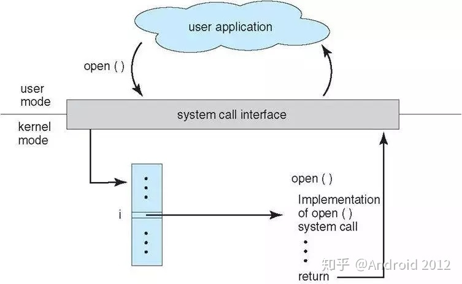
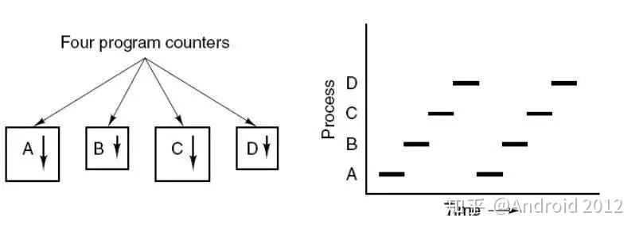
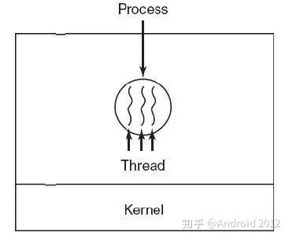
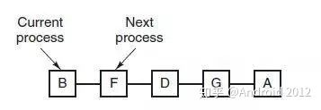
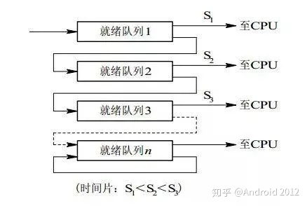
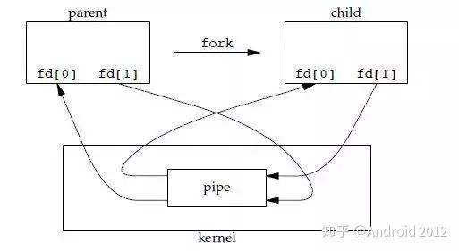
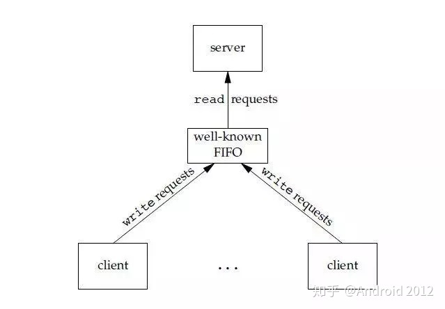

# 操作系统经典面试题

## 操作系统的基本功能

1. 进程管理

进程控制、进程同步、进程通信、死锁处理、处理机调度等。

2. 内存管理

内存分配、地址映射、内存保护与共享、虚拟内存等。

3. 文件管理

文件存储空间的管理、目录管理、文件读写管理和保护等。

4. 设备管理

完成用户的 I/O 请求，方便用户使用各种设备，并提高设备的利用率。

主要包括缓冲管理、设备分配、设备处理、虛拟设备等。

## 系统调度

如果一个进程在用户态需要使用内核态的功能，就进行系统调用从而陷入内核，由操作系统代为完成。

Linux 的系统调用主要有以下这些：

TaskCommands进程控制fork(); exit(); wait();进程通信pipe(); shmget(); mmap();文件操作open(); read(); write();设备操作ioctl(); read(); write();信息维护getpid(); alarm(); sleep();安全chmod(); umask(); chown();

## 进程管理

1. 进程

进程是资源分配的基本单元

进程控制块(process control block PCB)描述进程的基本信息和运行状态，所谓的创建进程、撤销进程，都是指对PCB的操作

下图显示了4个程序创建了4个进程，这四个进程可以并发的执行

2. 线程

线程是独立调度的基本单元

一个进程中可以有多个进程，他们共享进程资源

3. 区别

- 拥有资源
进程是资源的拥有者，但是线程不拥有资源，线程可以访问进程的资源

- 调度
线程是独立调度的基本单位。在同一进程中，线程的切换不会引起进程切换，从一个进程中的线程切换到另一个进程的线程的时候会引起进程切换

- 系统开销
由于创建或者撤销进程的时候，系统都要为分配或回收资源。入内存空间、IO设备等，所付出的开销远大于创建或撤销线程时候的开销。类似的，在进行进程切换的时候，涉及当前执行进程cpu环境的保存及新调度进程cpu环境的设置，而线程切换的时候只需保存和设置少量寄存器内容，开销很小

- 通信方面
线程间可以通过直接读写同一进程中的数据进行通信、但是进程间通信需要借助IPC

## 进度调度算法

1. 批处理系统

- 先来先服务 FCFS(fast-come-fast-serverd)

按照请求的顺序来进行调度

有利于长作业，单不利于短作业，因为短作业必须一直等待前面的长作业执行完毕后才能执行，而长作业又需要执行很长时间，造成了短作业等待时间过长

- 短作业优先 shortest job first SJF

按估计运行时间最短的顺序进行调度

长作业有可能会饿死，处于一直等待短作业执行完毕的状态。因为如果一直有短作业到来，那么场作业永远得不到调度

- 最短剩余时间优先 shortest remaining time next (SRTN)

按估计剩余时间最短的顺序进行调度

2. 交互式系统

- 时间片轮转

将所有就绪进程按FCFS的原则排成一个队列，每次调度的时候，把cpu时间分配给队首进程，该进程可以执行一个时间片。当时间片用完时候，由计时器发出时钟中断，调度程序便停止该进程的执行，并将它送往就绪队列的末尾，同时继续把CPU的事件分配给队首的进程

时间片轮转算法的效率和时间片的大小有很大的关系：

    - 因为进程切换都要保存进程的信息并且载入新进程的信息，如果时间片太小，会导致进程切换的过于频繁，在进程切换上会花费很多的事件
    - 如果时间片过长，那么实时性就不能得到保障了

- 优先级调度
为每个进程分配一个优先级，按优先级进行调度。

为了防止低优先级的进程永远等不到调度，可以随着时间的推移增加等待进程的优先级。

- 多级反馈队列

一个进程需要执行 100 个时间片，如果采用时间片轮转调度算法，那么需要交换 100 次。

多级队列是为这种需要连续执行多个时间片的进程考虑，它设置了多个队列，每个队列时间片大小都不同，例如 1,2,4,8,..。进程在第一个队列没执行完，就会被移到下一个队列。这种方式下，之前的进程只需要交换 7 次。

每个队列优先权也不同，最上面的优先权最高。因此只有上一个队列没有进程在排队，才能调度当前队列上的进程。

可以将这种调度算法看成是时间片轮转调度算法和优先级调度算法的结合。

## 进程间通信

1. 管道

管道是通过调用pipe函数创建的,fd[0]用于读,fd[1]用于写

    #include <unistd.h>
    int pipe(int fd[2]);

它具有以下的限制:
- 只支持半双工通信(单向交替传输)
- 只能在父子进程中使用

2. 命名管道

也称为命名管道，去除了管道只能在父子进程中使用的限制。

    #include <sys/stat.h>
    int mkfifo(const char *path, mode_t mode);
    int mkfifoat(int fd, const char *path, mode_t mode);

FIFO 常用于客户-服务器应用程序中，FIFO 用作汇聚点，在客户进程和服务器进程之间传递数据。

3. 消息队列

比于 FIFO，消息队列具有以下优点：

- 消息队列可以独立于读写进程存在，从而避免了 FIFO 中同步管道的打开和关闭时可能产生的困难；
- 避免了 FIFO 的同步阻塞问题，不需要进程自己提供同步方法；
- 读进程可以根据消息类型有选择地接收消息，而不像 FIFO 那样只能默认地接收

4. 信号量

它是一个计数器，用于为多个进程提供对共享数据对象的访问。

5. 共享内存(两种方式mmap,shm)

允许多个进程共享一个给定的存储区。因为数据不需要在进程之间复制，所以这是最快的一种 IPC。

需要使用信号量用来同步对共享存储的访问。

多个进程可以将同一个文件映射到它们的地址空间从而实现共享内存。另外 XSI 共享内存不是使用文件，而是使用使用内存的匿名段。

