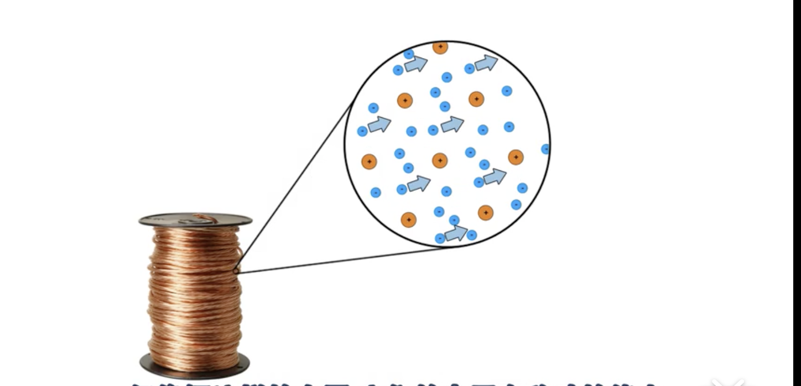
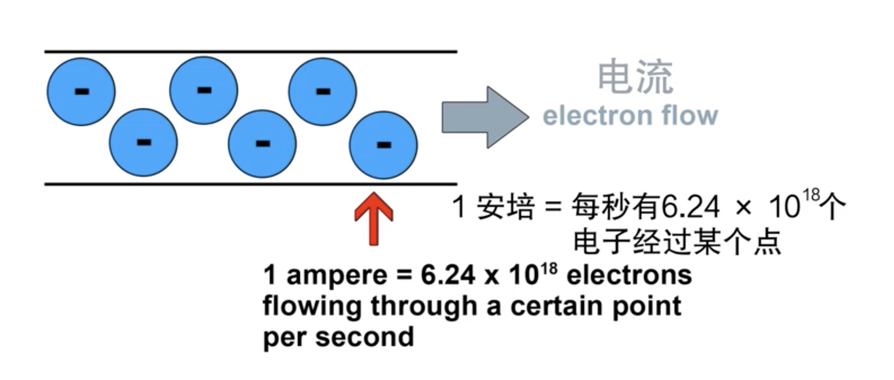
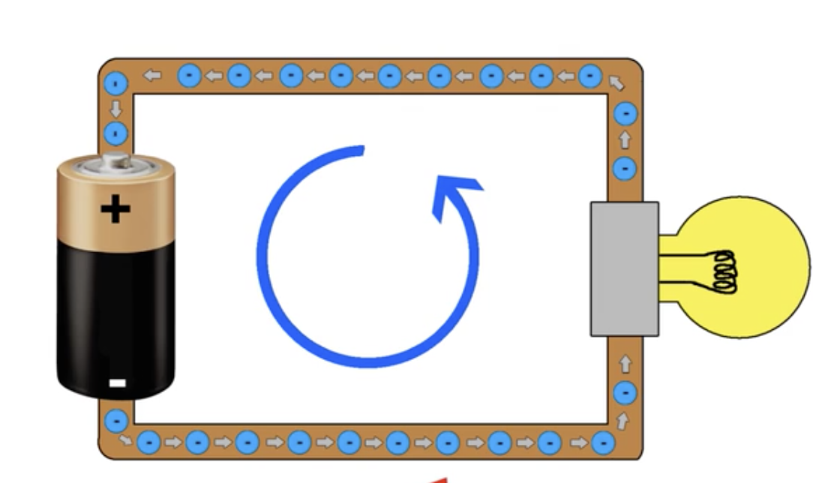
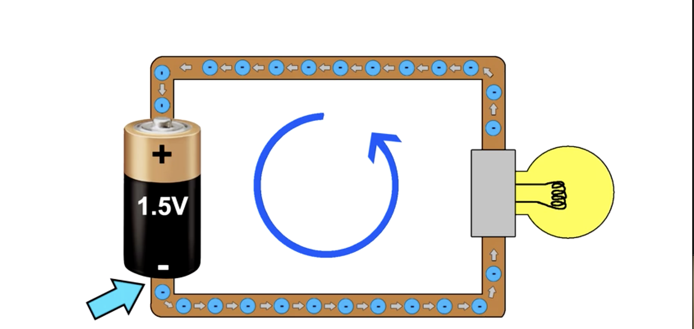
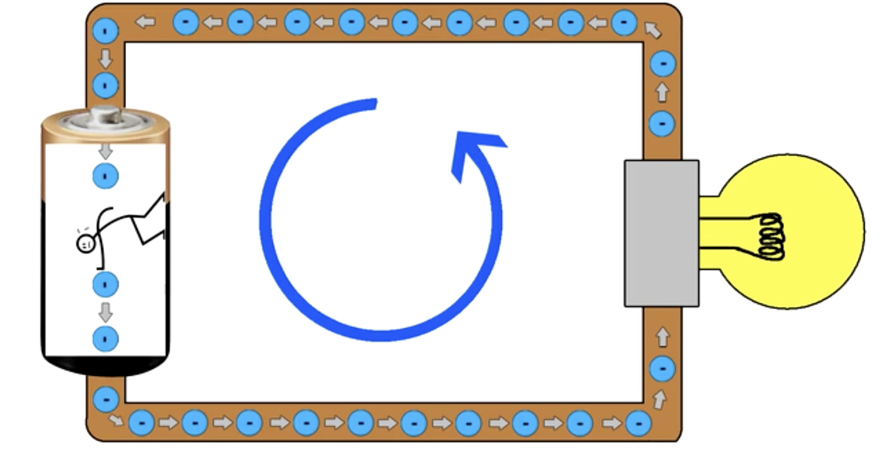
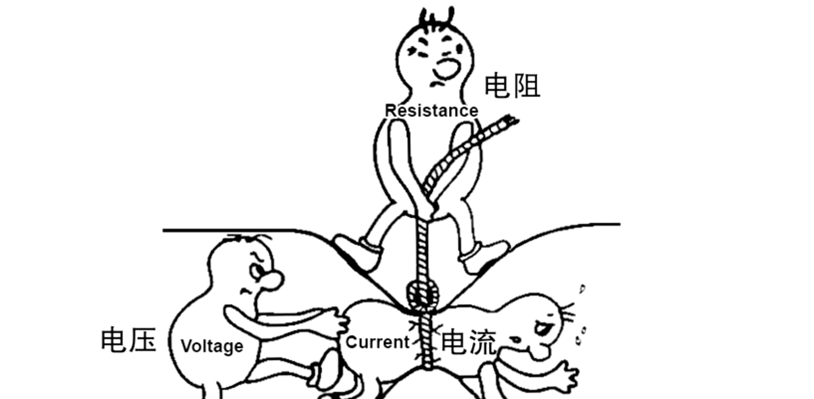

# 从零制作8位计算机实践课

> 吐槽下csapp,看完后才发现自己什么都不懂，对很多东西都是模模糊糊的，我将从电子出发，一步步的搞清楚计算机的本质，这是我好奇的地方，也是我努力的一点....

## 电学基础

### 1. 电流 - 单位时间内通过的电荷量

实际上所有的物体由原子组成

而原子的简化模型中，有一个带正电荷的中心叫原子核

而带负电荷的电子则绕着原子核旋转

同种电荷相互排斥，异种电荷相互吸引

大多数的物体的电子都是稳定的，他们就呆在那儿

但是像铜这样的金属，它们的电子有移动的能力

带正电荷的原子核保持不动，所以金属的形状不会发生变化,电子可以在原子间运动

但是因为带负电的电子是互相排斥的,所以当一个电子移动到另一个原子的时候，同时会把另外一个电子推向其他的原子

虽然电子只是移动了很少的距离，但电流的整体流动速度接近光速,这就是电流的本质

这应该就是对于电流的一个定义把---当电子经过某个物体的时候你可以说有电流通过

安培:每秒有多少电子流过物体

电路:电路是电流可以流动的闭合回路

 

###  2. 电压 - 两个点之间单位电荷的电势能之差

电压可以产生大电流用来供电，也可以传递数据(二进制)

使得电池负极这一端带的负电荷比电池正极多，负电荷会排斥负电荷,所以电池的负极会把电子推开，电子再推动其他的电子，最后才生了电流，同时流入电池正极的电子会被吸引

库伦:电荷的单位(实际我们不考虑电荷的数量)

安培:每秒通过的电荷量(电流量)

电荷 ==== 电流(每秒通过的电荷量)

1A = 1库伦/秒 = 6.25 x 10^18个电子

电压越大，意味着电势能之差越大，两点之间的电子数量差距也越大，也极易于产生更大的势能，从而电流的也就越快，电流的快，能量也就越大

例如电池的正负极之间就存在着电子数量的巨大差距，这也正是可以产生电压的一个主要原因。有了电压，我们就可以产生电流了

电压就像压力一样推动电子的运动

### 3. 电阻

但是如果电流过大，可能会烧坏设备，所以我们需要一个电阻来阻止电流过大，类似于保险丝这类的东西

当电子通过物体的时候，可能会受到一些阻力，像铜线这样的材料，他们的原子总是不停的震动，有时候电子会碰到阻挡它们的原子，产生电阻

一旦电阻产生,电子的部分动能（被阻挡的电子）就会转化为热能

电压(伏特) = 电流 x 电阻(其实就是斜率，变化的速度)

电阻(欧姆) = 电压 / 电流 

电流(安培) = 电压 / 电阻

### 4. 功率和瓦特

电荷运动产生的能量我们就叫功率(瓦特)

电压 * 电流 = 功率

例如灯泡，如果是一个40瓦的，意味着它电流产生了一个40焦耳的能量，这个能量转化成了光和热

### 5.KCL能量守恒

在电路中任何一个节点，流入的电流 = 流出的电流，电流恒定

任何一点的电压,绕着电路绕一圈,电源电压升(正极流出) = 元件电压降(正极流入)

### 6. 串联电阻

两个电阻串联，我们可以视作是一个大的电阻 

串联电路中的总电阻 = R1 + R2 + R3 .... + Rn

推导公式: I(R1 + R2) = V

### 7.串联电阻的分压

v1 = (r1 / r1+r2) * v

v2 = (r2 / r1+r2) * v

(v / r1 + r2) * r1 = v1

(v / r1 + r2) * r2 = v2

我们首先不考虑电阻为0的情况，我们假定电路中已经存在一定的电阻了

在一个6v的电源电压下,通过了一个1Ω的电阻,那么,电流会因为这个电阻变小----电阻改变了电流,电流的大小是6A,那么,这个时候并没有产生分压的情况,电压依然是6v

但是,实际的情况真的是会稍微的变小一点的,实际每根导线上都会有微小的电阻

如果这时候我们再加入一个1Ω的电阻,整体的电阻变成了2Ω,电流变成了3A了,通过电阻1和电阻2的电流都是3A,那么,电阻1的电压变成了3v,电阻2的电压也是3v,就出现了分压的情况....

### 8.并联电阻

那么并联的电阻R = (1 / R1 + 1 / R2) / 1,流过电阻的电流分别不同...

并联上电阻的电流I1 = I * (R2 / R1 + R2)

并联上电阻的电流I2 = I * (R1 / R1 + R2)

并联上的电阻电流In = 按照两个电阻的方式进行计算即可...

电阻的计算方式: R = e电阻率 * (L电阻的长度 / A电阻的横切面积)

### 9. 串联、并联的总结

串联电路中,串联元件中的电流都相等,各个元件的电压不同,但总的电压不变 --- 电阻越大，电压越大

并联电路中，并联元件上的电压都相等,但是电流不同,但总的电流不变 --- 电阻越大,电流越小

### 10.电阻的功率

